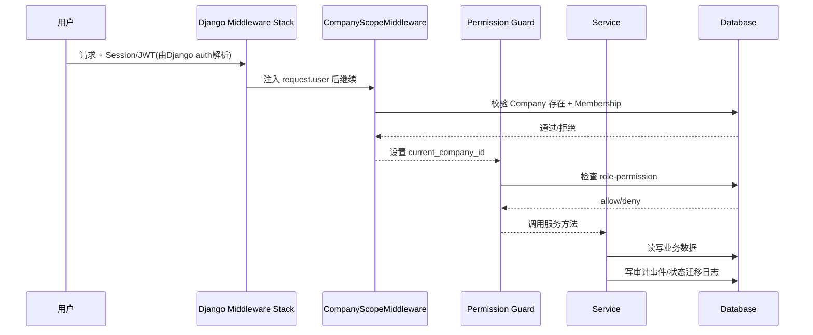
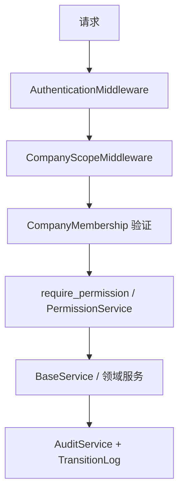
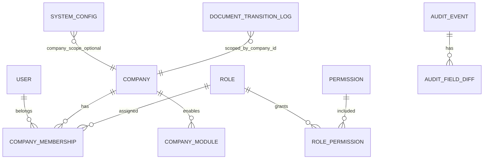

# 架构审计报告（基于 specs/spec 权威规则）

> 审计范围：`specs/spec/*` 与 `backend/*`
>
> 结论方法：仅按 `specs/spec` 定义比对当前实现，不引入外部假设。

## 第一部分 — 系统层次架构

```mermaid
graph TD
    Client[客户端/前端] --> URL[config.urls 路由]
    URL --> MW[CompanyScopeMiddleware]
    MW --> AuthMW[AuthenticationMiddleware]
    MW --> Guard[RBAC require_permission 守卫]
    Guard --> Service[Service 层(BaseService/DocumentStateTransitionService)]
    Service --> Domain[领域模型(company/rbac/doc/audit/system_config)]
    Service --> Audit[AuditService]
    Domain --> DB[(SQLite DB)]
```

### 合规性判断

- **部分符合**：
  - Kernel 模块（core/company/auth/doc/audit/config）在当前代码中基本可映射为 `shared/company/rbac/doc/audit/system_config`，总体分层存在。  
  - 中间件链中已存在认证与公司作用域解析，符合“认证→作用域→权限→服务层→数据库”的主流程意图。
- **偏离点**：
  1. **流程顺序表达偏差（实现细节）**：Django 中 `AuthenticationMiddleware` 在 `CompanyScopeMiddleware` 之前执行；虽然运行效果可用，但架构图中应明确为先认证再公司作用域解析。  
  2. **服务层前的“模块启用检查”缺失**：规范要求权限守卫先验证 company module enabled；当前权限实现仅检查角色权限。  
  3. **缺少显式 API 业务入口层**：除 `/health` 外未见业务 API 视图，导致“API→服务层”边界在运行链路中不完整。

---

## 第二部分 — 模块依赖关系图

```mermaid
graph LR
    Config[config(settings/urls)] --> Shared[shared(core infra)]
    Config --> Company
    Config --> RBAC
    Config --> Doc
    Config --> Audit
    Config --> SysConfig[system_config]

    Shared --> Company
    Shared --> RBAC
    Shared --> Audit

    Company --> RBAC
    RBAC --> Company

    Doc --> Shared
    Doc --> Audit

    SysConfig --> SysConfigModel[SystemConfig model]
    Audit --> AuditModel[AuditEvent/AuditFieldDiff]

    classDef bad fill:#ffdddd,stroke:#ff0000,color:#900;
    RBAC --> Company
```

### 依赖分析

- 可接受依赖：
  - `doc -> shared/audit`、`shared -> rbac/audit`（基础服务复用）。
- **需高亮风险依赖**：
  - `rbac.services` 依赖 `company.models.CompanyMembership`，同时 `company.models` 又通过字符串外键依赖 `rbac.Role`，形成**双向耦合**，增加内核子模块耦合度。虽未违反“Kernel 不依赖业务模块”，但不利于边界清晰。

---

## 第三部分 — 请求处理流程



### 流程合规性

- **符合项**：认证后解析公司作用域、校验 membership、权限守卫、服务层落库与日志。
- **不符合项**：
  1. 缺少“company module enabled”检查步骤。  
  2. `CompanyScope` 仅支持 Header，未实现规范列出的 JWT/session/path 备选来源。  
  3. 未见统一请求级审计（每个请求记录 user/company/action/timestamp）。

---

## 第四部分 — 安全架构



### 安全分析

- 认证模型：
  - 使用 Django `AuthenticationMiddleware` 与 `request.user` 判定身份，未认证用户在公司校验与权限校验中会失败。
- 权限实施：
  - 已实现 RBAC（Role/Permission/RolePermission）和装饰器守卫。
  - **漏洞/缺口**：未实现“模块启用检查”作为权限前置条件。
- 审计日志：
  - 有 `AuditEvent` + `AuditFieldDiff`，可记录 actor/action/resource/timestamp/字段变化。
  - **缺口**：未见“每个请求”级别日志保障。
- 敏感操作：
  - 文档状态迁移会写 `DocumentTransitionLog` + 审计事件。
  - **规则偏离**：状态机默认不支持 `COMPLETED -> CANCELLED`，与 “Any -> CANCELLED” 不一致。

---

## 第五部分 — 数据模型关系



### 模型一致性检查

- **符合项**：
  - `User -> CompanyMembership -> Company/Role` 关系与规范一致。  
  - 审计模型包含事件与字段差异。
- **部分偏离**：
  - 当前仓库尚无采购/销售/库存等业务表，无法全面验证“所有业务表必须有 company_id”。
  - 已有的业务态日志 `DocumentTransitionLog` 包含 company_id，符合多租户隔离方向。

---

## 第六部分 — 基础设施完整性检查

| 检查项 | 结论 | 说明 |
|---|---|---|
| 服务层分离 | 基本符合 | 存在 `BaseService` 与各模块 service。 |
| 领域模型隔离 | 基本符合 | 模块化模型目录清晰，但 company/rbac 双向耦合。 |
| 基础设施工具类 | 符合 | 有常量、异常、QuerySet、中间件、服务基类。 |
| 数据库抽象 | 部分符合 | CompanyQuerySet 提供作用域工具，但并未强制所有查询自动带 company 过滤。 |
| 模块边界 | 部分符合 | Kernel 内模块齐全；API 层薄弱且缺 module-enabled guard。 |

### 明确违规/缺失清单

1. **权限守卫未校验模块启用状态（违规）**。  
2. **文档状态机默认迁移不满足 Any→CANCELLED（违规）**。  
3. **Company Scope 解析来源不完整（缺失）**。  
4. **请求级审计日志缺失（缺失）**。  
5. **company/rbac 双向耦合导致边界弱化（架构风险）**。

---

## 第七部分 — 最终裁决

- **架构合规性评分：78 / 100**
- **主要风险**：
  1. 权限前置条件不完整（缺 module enabled 检查）。
  2. 状态机规则与规范不一致（取消流转）。
  3. 请求级审计闭环不完整。
  4. 内核子模块双向依赖带来的演进风险。
- **建议重构项**：
  1. 在 `PermissionService` 增加 CompanyModule 启用检查。  
  2. 调整文档状态默认规则为 `Any -> CANCELLED`（至少覆盖 COMPLETED）。  
  3. 在中间件或统一入口增加 request audit logging。  
  4. 抽出 membership 查询接口到 `company` 服务层，减少 `rbac -> company` 直依赖。  
  5. 扩展 Company Scope 来源：header + session/JWT/path 参数策略化解析。
- **是否仍遵循原始框架**：
  - **是（总体仍属分层内核架构）**，但存在若干关键规则偏离，需尽快修复。

---

## 第八部分 — 架构模式检测（高级）

### 当前模式判断

- 当前系统**仍主要是分层架构（Layered Architecture）**，带有轻量“服务层 + 领域模型 + 基础设施”特征。  
- 尚未达到严格整洁架构（Clean Architecture）要求（例如依赖倒置、用例层独立接口、基础设施适配器边界）。

### 建议修正架构图（目标态）

```mermaid
graph TD
    UI[Client/API View] --> UseCase[Application Service / Use Cases]
    UseCase --> Domain[Domain Models & Policies]
    UseCase --> PortPerm[Permission Port]
    UseCase --> PortAudit[Audit Port]
    UseCase --> PortRepo[Repository Port]

    PortPerm --> RBACImpl[RBAC + ModuleEnabled Guard]
    PortAudit --> AuditImpl[Audit Adapter(Request + Event)]
    PortRepo --> ORMImpl[Django ORM Repositories(company-scoped)]

    AuthMW[AuthenticationMiddleware] --> ScopeMW[CompanyScopeResolver(header/session/jwt/path)]
    ScopeMW --> UI
```

该目标态可保持现有 Django 生态，同时强化边界、可测试性与规则一致性。
