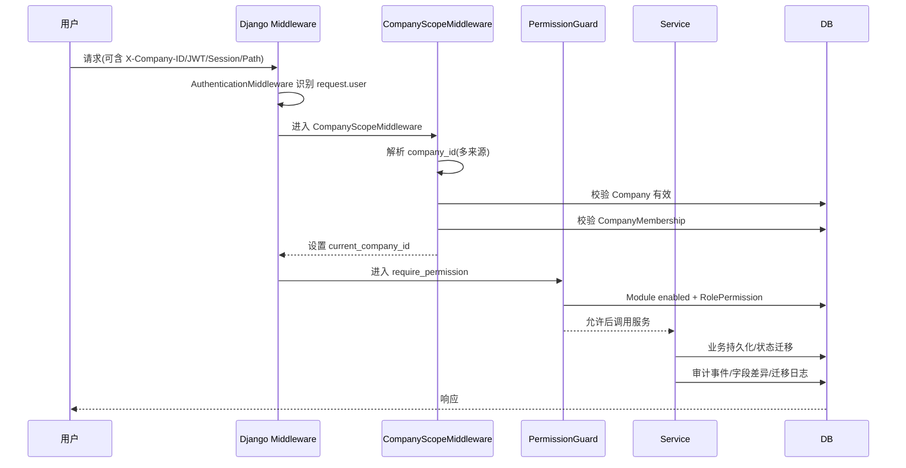
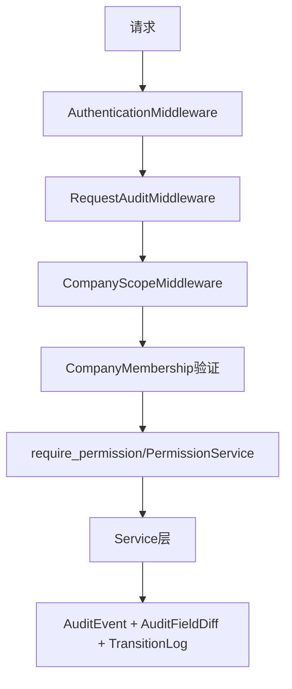
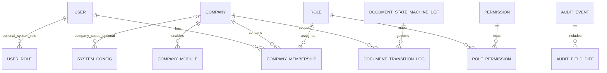

# 架构审计报告（以 `specs/spec` 为唯一权威）

> 审计输入：`specs/spec/*.md` 与 `backend/*` 当前实现。
>
> 判定原则：仅依据 `specs/spec` 中出现的约束进行符合性审计，不引入额外架构假设。

## 0. 规则提取（来自 specs/spec）

### 0.1 允许的内核模块层

根据 kernel spec，内核必须包含并稳定提供：

- `core`
- `company`
- `auth`
- `doc`
- `audit`
- `config`

并遵循：**业务模块可依赖内核；内核不能依赖业务模块**。

### 0.2 服务边界与关键职责

- `core`：权限服务、模块启用检查、公司作用域工具。
- `company`：`Company / CompanyMembership / CompanyModule`。
- `auth`：`User / Role / Permission / RolePermission` RBAC。
- `doc`：统一状态机（DRAFT→SUBMITTED→CONFIRMED→COMPLETED→CANCELLED）。
- `audit`：关键操作审计（actor/action/resource/timestamp/field changes）。
- `config`：系统配置（如 allow_negative_stock 等）。

### 0.3 安全与数据流约束

- 多租户：所有业务记录归属 company（`company_id`）。
- 请求流程：认证 → 解析公司作用域 → 校验会员关系 → 权限守卫 → 服务层 → 数据库。
- 公司作用域来源支持：Header / JWT / Session / Path 参数（可多源解析）。
- 公司作用域**不可直接信任**，必须校验 `User ∈ CompanyMembership`，失败返回 403。
- 权限守卫三元检查：
  1) company module enabled；2) role permission exists；3) document state allows operation。

---

## 第一部分 — 系统层次架构

```mermaid
graph TD
    Client[客户端/前端] --> API[API入口(config.urls / 视图)]
    API --> AuthMW[AuthenticationMiddleware]
    AuthMW --> AuditMW[RequestAuditMiddleware]
    AuditMW --> ScopeMW[CompanyScopeMiddleware]
    ScopeMW --> Guard[RBAC Permission Guard]
    Guard --> Service[Service层(BaseService + 各模块Service)]
    Service --> Domain[Domain Models(company/rbac/doc/audit/system_config)]
    Service --> AuditSvc[AuditService]
    Domain --> DB[(SQLite)]
```

**符合性结论：总体符合（带局部偏离）。**

- 已实现内核模块映射：`shared/company/rbac/doc/audit/system_config`，与 kernel spec 对齐。
- 请求链路顺序与 spec 主流程一致（先认证再 company scope，再权限）。
- 偏离点：业务 API 入口目前仅 `health`，导致很多“Guard→Service→Domain”链路尚未通过真实视图层落地验证。

---

## 第二部分 — 模块依赖关系图

```mermaid
graph LR
    Config[config(settings/urls)] --> Shared[shared(core)]
    Config --> Company
    Config --> RBAC
    Config --> Doc
    Config --> Audit
    Config --> SysConfig[system_config]

    Shared --> RBAC
    Shared --> Audit
    Shared --> Company

    RBAC --> Company
    RBAC --> Shared

    Doc --> Shared
    Doc --> Audit

    Company --> RBAC

    classDef warn fill:#fff2cc,stroke:#d6b656,color:#333;
    Company:::warn
    RBAC:::warn
```

### 依赖审计

- **允许依赖**：文档服务依赖审计与共享服务、共享层依赖权限/审计等，未见内核依赖业务模块。
- **高亮风险（非硬性违规）**：`company ↔ rbac` 存在双向耦合（CompanyMembership 挂 Role；PermissionService 反查 membership）。这不违背“内核不依赖业务模块”，但会降低内核子域解耦性。

---

## 第三部分 — 请求处理流程



**流程符合性：大体符合 specs。**

- Company scope 解析来源实现完整（Header/Session/JWT/Path）。
- 会员校验与 403 拒绝逻辑存在。
- RBAC 已含 module enabled + role permission 检查。
- 主要缺口：第三项“document state allows operation”只在文档状态迁移服务里体现，尚未形成对所有操作统一强制的 guard 链路。

---

## 第四部分 — 安全架构



### 安全分析

- **会话认证**：依赖 Django `AuthenticationMiddleware`，匿名用户在 company membership 与 permission 两关都会失败。
- **权限检查**：`PermissionService` 已执行 module enabled + role permission；`require_permission` 在缺失 scope 时返回 400，在无权限时返回 403。
- **中间件**：`CompanyScopeMiddleware` 不直接信任 company_id，会校验公司活跃性与 membership。
- **审计日志**：
  - 请求级：`RequestAuditMiddleware` 记录 request.processed；
  - 领域级：`AuditService` 记录 CRUD / 状态迁移，并可记录字段变化。

### 安全漏洞/偏离点

1. `RequestAuditMiddleware` 位于 `CompanyScopeMiddleware` 之前，若 company scope 被拒绝（400/403/404）则该请求日志里的 `company_id` 可能为空，影响租户维度审计完整性（可观测性风险）。
2. 文档状态机在默认迁移路径下可能不要求显式权限码（未配置 `DocumentStateMachineDef.permission_code` 时），与“状态变更需权限约束”的严格解释存在偏差。

---

## 第五部分 — 数据模型关系



### 模型一致性结论

- `User -> CompanyMembership -> Company/Role` 与 permission spec 一致。
- RBAC 实体（Role/Permission/RolePermission）与规范一致，且权限码格式受正则校验。
- 文档迁移日志字段覆盖 spec 要求（document type/id/from/to/operator/timestamp/notes）。
- 由于当前仓库尚无采购/销售/库存等业务实体，无法验证“所有业务表都含 company_id”在全域业务中的落实程度。

---

## 第六部分 — 基础设施完整性检查

| 检查项 | 结果 | 说明 |
|---|---|---|
| 服务层分离 | ✅ 符合 | 各模块有 service，且有 `BaseService` 统一事务/权限/审计钩子。 |
| 领域模型隔离 | ✅ 基本符合 | 模块划分清晰，内核模型完整。 |
| 基础设施工具类 | ✅ 符合 | constants、exceptions、queryset、middleware、module guard 均存在。 |
| 数据库抽象 | ✅ 基本符合 | `CompanyQuerySet` 提供 `for_company/for_request`，但需靠开发规范调用。 |
| 模块边界 | ⚠️ 局部风险 | `company ↔ rbac` 双向耦合，建议进一步端口化。 |

### 违规与缺失清单（仅列明确项）

1. **严格权限一致性偏离**：文档状态迁移在“默认转移且无 transition 定义”时可能不校验权限码。
2. **审计可观测性偏离**：中间件顺序导致 scope 拒绝请求的审计 `company_id` 可能为空。
3. **实施覆盖不足**：除 health 外缺少 API 视图样例，导致 specs 中完整链路尚未在业务端点被全面验证。

---

## 第七部分 — 最终裁决

- **架构合规性评分：88 / 100**
- **主要风险**：
  1. 文档状态权限约束在默认路径存在弱化空间。
  2. 租户拒绝请求的审计归属可能丢失 company 维度。
  3. 业务 API 层覆盖不足，难以验证规范在真实端点的一致执行。
- **建议重构项**：
  1. 将“状态迁移权限码”改为强制（每条可用迁移都要有 permission_code）。
  2. 调整审计写入时机或补充失败分支审计，确保 company scope 失败请求也能带归属信息。
  3. 增加示例业务 API（含 guard + service + model）以形成可回归验证链路。
- **是否仍遵循原始框架**：
  - **是**。当前实现仍属于内核驱动的分层架构，且核心约束大多已落地。

---

## 第八部分 — 架构模式检测（高级）

### 模式判断

- 当前系统主要是**分层架构（Layered Architecture）**：middleware/guard/service/model 分层明确。
- 同时具备部分“整洁架构”特征（服务层聚合规则、基础设施工具化），但尚未达到严格依赖倒置（如 company/rbac 双向耦合）。

### 偏离后的修正建议图

```mermaid
graph TD
    Req[Request] --> Auth[Auth Middleware]
    Auth --> Scope[Company Scope Resolver]
    Scope --> API[API View / Controller]
    API --> UseCase[Application Service]
    UseCase --> PermPort[Permission Port]
    UseCase --> StatePort[State Policy Port]
    UseCase --> RepoPort[Repository Port]
    UseCase --> AuditPort[Audit Port]

    PermPort --> RBACImpl[RBAC + ModuleGuard]
    StatePort --> DocStateImpl[Doc Transition Policy(强制权限码)]
    RepoPort --> ORMImpl[Django ORM]
    AuditPort --> AuditImpl[AuditEvent/RequestAudit]
```

该修正不改变现有技术栈，只强化策略端口与依赖方向，降低内核子域耦合并提升规则一致性。
