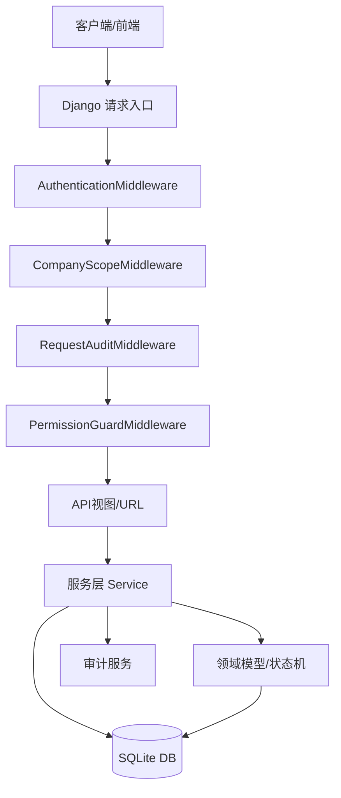
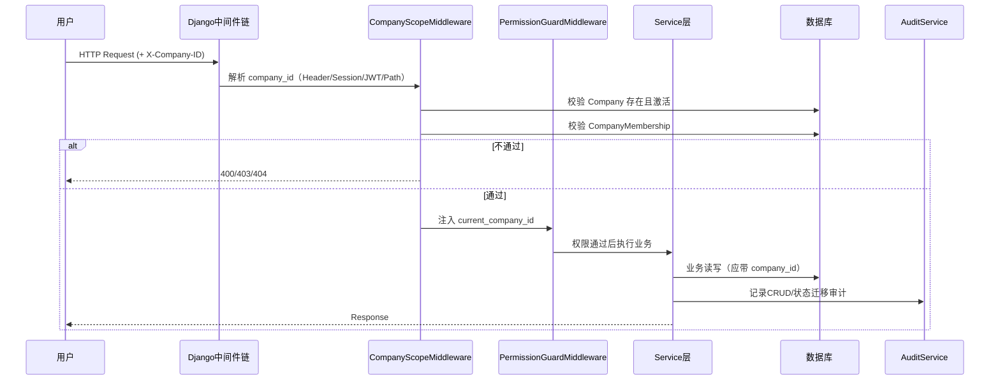
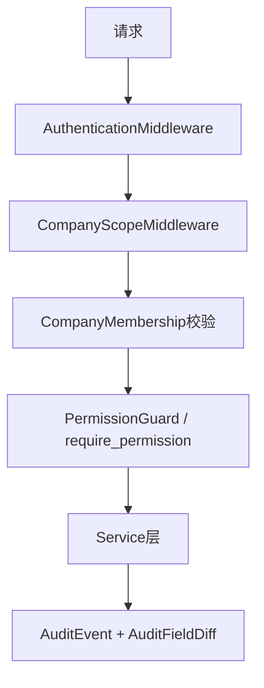
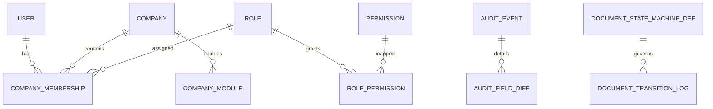
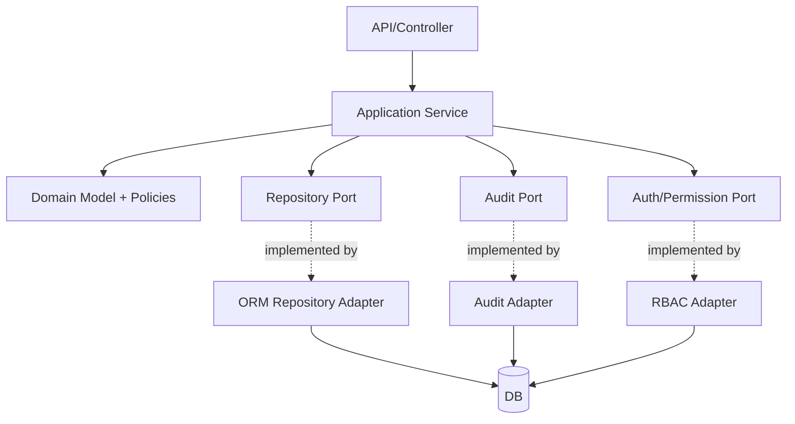

# 架构审计报告（基于 `specs/spec`）

> 审计基线：`specs/spec` 目录全部文件（唯一权威）。
> 审计对象：`backend/` 现有实现。

## 审计方法与规则提取

从 `specs/spec` 提取出的关键架构约束如下：

- 分层与内核模块：`core/company/auth/doc/audit/config` 为稳定 Kernel，业务模块可依赖 Kernel，Kernel 不可反向依赖业务模块。
- 多租户隔离：所有业务表应带 `company_id`；每次请求在单一公司作用域下执行；必须校验用户是否属于该公司；查询应带 `WHERE company_id=current_company`。
- 权限模型：RBAC，且权限放行需同时满足：模块启用、角色权限存在、文档状态允许。
- 文档状态机：`DRAFT→SUBMITTED→CONFIRMED→COMPLETED`，`Any→CANCELLED`，并记录迁移日志。
- 审计：记录关键操作，含 actor/action/resource/timestamp/field changes。

---

## 第一部分 — 系统层次架构



**符合性结论**
- 基本分层存在：中间件→服务→模型→数据库，且 `doc` 服务通过 `BaseService` 触发权限与审计。
- 与规范偏离：当前 API 仅 `health/`，缺少明确业务视图层与端到端业务流，无法充分验证“所有业务请求”都遵循公司作用域与权限守卫。

---

## 第二部分 — 模块依赖关系图

```mermaid
graph LR
    subgraph Kernel
      Shared[shared(core)]
      Company[company]
      RBAC[rbac(auth)]
      Doc[doc]
      Audit[audit]
      Config[system_config(config)]
    end

    Shared --> Company
    Shared --> RBAC
    Shared --> Audit

    RBAC --> Company
    RBAC --> Shared

    Doc --> Shared
    Doc --> Audit

    Config --> Config

    Company --> RBAC
```

**依赖评估**
- 观察到的依赖方向总体在 Kernel 内部闭环，未发现“Kernel 依赖业务模块”的反向违规。
- ⚠️ `company.models` 直接引用 `rbac.Role`，`rbac.services` 又依赖 `company.services`，形成强耦合环（Company↔RBAC），虽不违反“Kernel 不依赖业务模块”，但增加模块演进成本。

---

## 第三部分 — 请求处理流程



**符合性结论**
- 公司作用域解析来源与规范一致（Header/JWT/Session/Path）。
- 会员校验与 403 拒绝行为符合规范。
- 偏离点：`PermissionGuardMiddleware` 依赖 `request.required_permission_code`，当前代码库未见统一设置点，导致中间件层权限检查可能“形同虚设”；主要依赖装饰器/服务调用方自律。

---

## 第四部分 — 安全架构



**安全分析**
- 认证模型：使用 Django `request.user` 认证态，未实现 JWT 中间件本体（但支持读取 JWT payload 字段）。
- 权限实施：`PermissionService` 满足“三重检查”中的两项（模块启用 + 角色权限）；文档状态约束由 `doc` 状态机服务落实。
- 审计日志：请求级日志 + CRUD/状态迁移日志均存在。

**安全漏洞/风险点**
- ❗`settings.py` 含硬编码 `SECRET_KEY` 且 `DEBUG=True`，不满足生产安全基线。
- ❗多租户强制查询规则未在 ORM 层做“全局不可绕过”约束（仅提供 `CompanyQuerySet.for_request/for_company` 助手），开发者仍可能写出未带 `company_id` 的查询。
- ⚠️ 审计中间件在权限中间件之前执行，拒绝请求也会记审计（可接受），但若后续需要“仅成功操作审计”需调整策略。

---

## 第五部分 — 数据模型关系



**一致性检查**
- `CompanyMembership`、`Role/Permission/RolePermission`、`DocumentTransitionLog`、`AuditEvent` 均与 spec 语义基本匹配。
- 偏离点：目前仓库缺少实际业务单据模型（如采购/销售单），因此无法验证“所有业务表均有 `company_id`”。

---

## 第六部分 — 基础设施完整性检查

- 服务层分离：✅ 存在 `services.py`，`doc` 状态迁移逻辑未放在 view/model。
- 领域模型隔离：⚠️ 有状态机定义与日志模型，但业务领域模型尚不完整。
- 基础设施工具类：✅ `BaseService`、`ModuleGuardService`、`CompanyScopeMiddleware`、`CompanyQuerySet` 已提供。
- 数据库抽象：⚠️ 主要依赖 Django ORM；无统一仓储层，不违规但可演进。
- 模块边界：⚠️ Kernel 子模块存在双向耦合（company↔rbac）。

**违规清单（按严重度）**
1. 高：生产安全配置不合规（`DEBUG=True`，硬编码 `SECRET_KEY`）。
2. 中：公司隔离规则未被“强制技术手段”完全约束（仅约定+helper）。
3. 中：权限中间件缺少统一 required_permission 注入机制。
4. 低：Company 与 RBAC 双向依赖，边界可优化。

---

## 第七部分 — 最终裁决

- **架构合规性评分：78/100**
- 主要风险：
  - 生产安全参数未收敛；
  - 多租户隔离依赖编码规范，缺少硬约束；
  - 权限中间件接入点不完整。
- 建议重构项：
  1. 引入环境变量配置与生产安全开关；
  2. 为业务模型统一接入公司作用域管理器/数据库级约束；
  3. 在视图基类或路由层统一声明 `required_permission_code`；
  4. 解耦 company 与 rbac（通过接口层或查询服务）。
- 结论：当前实现**总体仍遵循原始分层/KERNEL框架方向**，但属于“内核雏形阶段”，需补齐强制约束才能达到规范级稳态。

---

## 第八部分 — 架构模式检测（高级）

**检测结果**
- 当前更接近“分层架构 + Kernel 模块化”而非严格整洁架构。
- 原因：
  - 具备中间件/服务/模型分层；
  - 但缺少独立应用层接口与依赖倒置边界（例如 domain interface / repository ports）。

**建议修正后的目标架构图**



该图在保持 `specs/spec` 内核能力的同时，强化依赖方向（内向依赖），减少模块环依赖。
